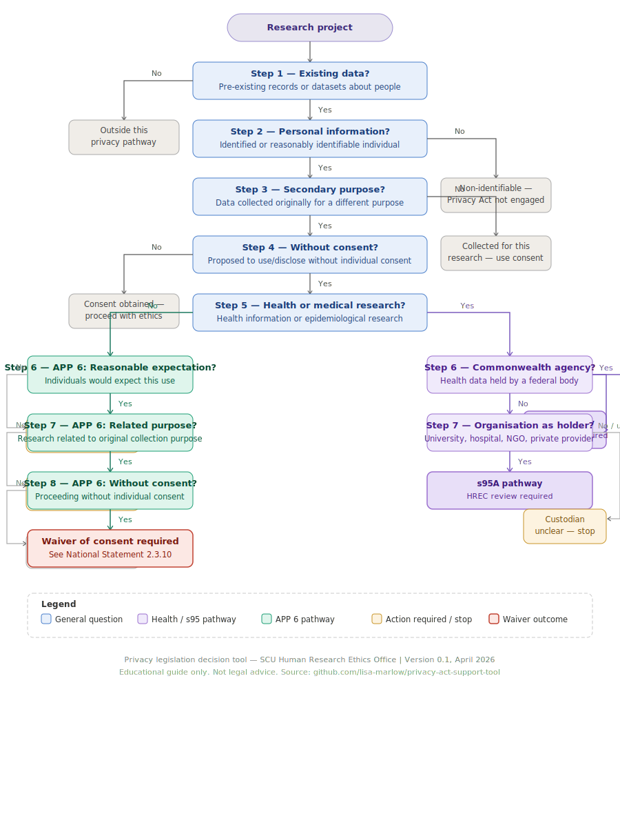

# Privacy Act, 1988 (Cwth): Support Tool for Researchers

This repository hosts an interactive decision-support tool designed to assist researchers in thinking through whether, and how, privacy obligations may be engaged in the context of their research activities.

The tool is intended for use by Southern Cross University (SCU) researchers and staff, particularly for projects involving existing data, administrative records, health information, or other information about individuals.

---
## Disclaimer
Nothing in this tool may be relied upon as legal advice. It is intended to explain how the Privacy Act applies to research generally; researchers must ascertain the status of their own research proposals with respect to Privacy legislation.

## Purpose and scope

The Privacy Act Support Tool is an **educational guide**. It helps users:

- Identify when privacy legislation is *likely* to be relevant to a research project
- Understand which broad regulatory frameworks may apply (e.g. Australian Privacy Principles, s95 / s95A Guidelines)
- Recognise common decision points that warrant further advice or ethics review

The tool focuses primarily on **research use of data or information about people**, including secondary use of existing datasets.

---

## Decision logic (simplified)

---

## What this tool does *not* do

This tool:

- **Does not provide legal advice**
- **Does not replace ethics review**
- **Does not make definitive determinations** about compliance, exemptions, or approvals
- **Does not cover all governance obligations** that may apply to research (e.g. contractual, confidentiality, institutional policy, or funder requirements)

Final determinations always rest with the relevant decision‑makers, including ethics committees, the University, and (where applicable) regulators.

---

## Important limitations

Even where the Privacy Act does not appear to be engaged in the way a researcher first expects:

- Ethics review will be required
- Confidentiality obligations apply
- Consent requirements may still be relevant
- Other SCU governance processes may be triggered

Users are encouraged to seek advice where uncertainty remains.

---

## Getting advice

If you are unsure at any stage, or if your project does not fit neatly within the scenarios described, please contact:

- The Ethics Office  
- The Privacy Office  
- Your Faculty Associate Dean (Research) or relevant governance contact

Early advice can help prevent delays or misunderstandings later in the research process.

---

## Status and versioning

This tool is under active development and may be updated over time to improve clarity, usability, and alignment with evolving guidance.

Version information is shown on the live tool.

---

## License and reuse

This tool is provided for educational and internal guidance purposes.  
Reuse or adaptation should retain the decision‑support framing and appropriate disclaimers.

